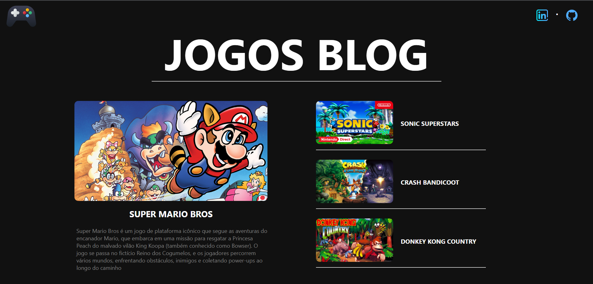
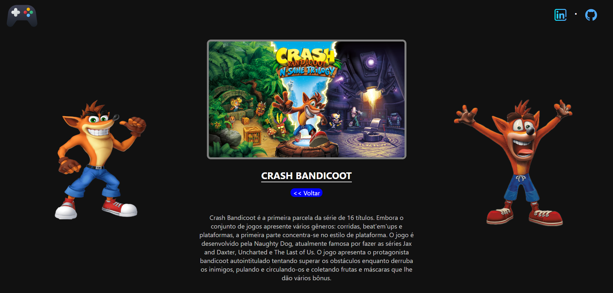
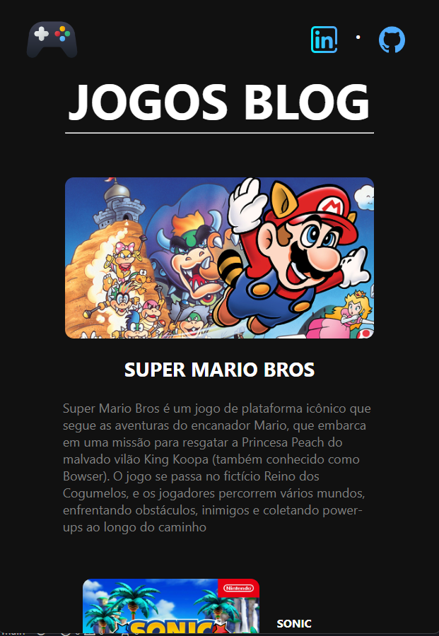
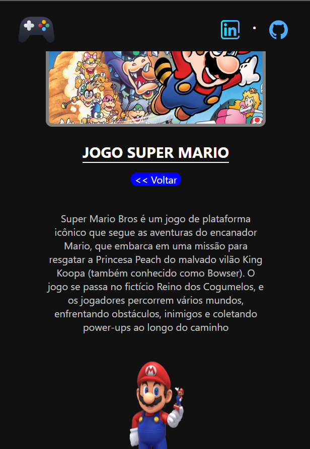

<h1 align="center"> BLOG JOGOS </h1>

Desenvolvido por:
 Mislene Moura - [Linkedin](https://www.linkedin.com/in/mislene-silva-moura-1211531b4//) |
   [Github](https://github.com/MisleneSM)

## Índice

* [1. Resumo do projeto](#1-resumo-do-projeto)
* [2. Objetivos de aprendizagem](#2-objetivos-de-aprendizagem)
* [3. Resultado do Projeto](#3-resultado-do-projeto)
* [4. Tecnologias Utilizadas](#4-tecnologias-utilizadas)

***

## 1. Resumo do Projeto🤩

Desenvolvido um mini projeto de Blog responsivo, tendo como tema os nossos queridos jogos da Nintendo, onde pude aprimorar novos conhecimentos no Framework Angular. Desafio promovido e proposto pela [Dio](https://www.dio.me/) do programa de Bootcamp Desenvolvimento Frontend com Angular - Banco Pan, administrada pelo professor [Felipe Aguiar](https://github.com/felipeAguiarCode)

Para acessar o resultado do projeto e se aventurar nas descrições dos jogos, basta clicar aqui no [Link]()

## 2. Objetivos de aprendizagem✅

- Angular
- TypeScript
- Trabalhando com Web Components no Frontend
- Introdução ao Ecossistema Angular
- LifeCycle Hooks
- Single Page Application
- Módulos
- Routing

## 3. Resultado do Projeto📝

##### Desktop

##### Mobile

## 4. Tecnologias Utilizadas✅

   
  